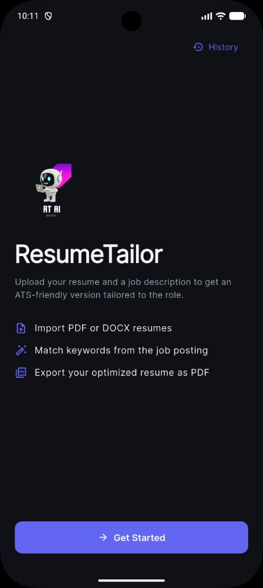
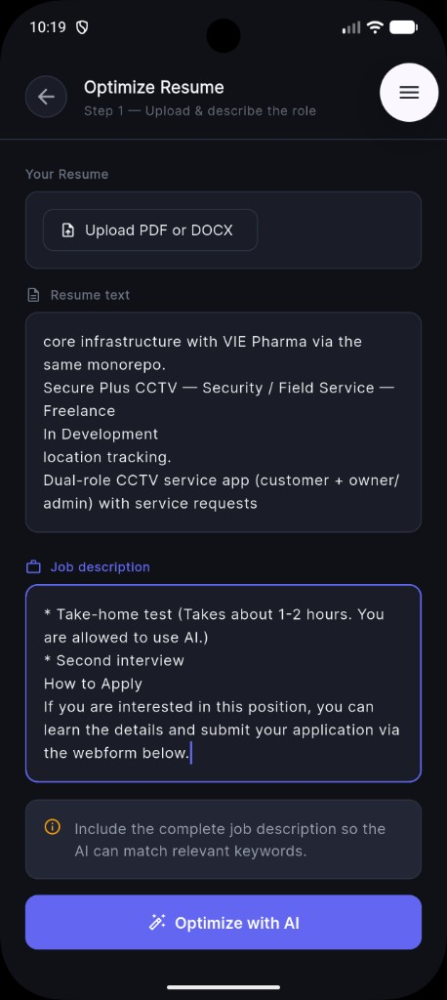
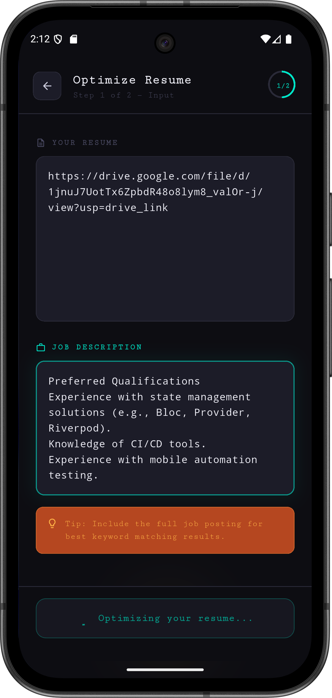
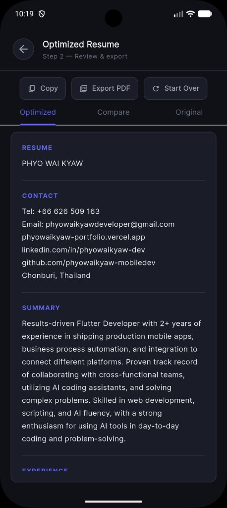

# ResumeTailor AI

An AI-powered resume optimization app built with Flutter that helps job seekers tailor their resumes for ATS (Applicant Tracking Systems) by matching keywords from job descriptions.

---

## Screenshots

| Home | Input | Result | Result |
|------|-------|--------|--------|
|  |  |  |  |

---

## Features

- **AI-Powered Optimization** — Uses Groq AI (LLaMA 3.3 70B) to intelligently optimize your resume
- **PDF/DOCX Import** — Upload resumes with on-device OCR fallback for scanned PDFs
- **ATS-Friendly** — Matches keywords from job descriptions to increase ATS pass rate
- **Compare Diff** — See original vs optimized side-by-side changes
- **History** — Save and reopen past optimizations locally
- **PDF Export** — Export optimized resume as a multi-page PDF
- **Android + iOS** — Cross-platform with RT AI branding and splash screen

---

## Tech Stack

- **Framework** — Flutter / Dart
- **AI Model** — LLaMA 3.3 70B via Groq Cloud API
- **HTTP** — `http` package
- **Environment** — `flutter_dotenv`
- **PDF Export** — `pdf` + `printing` packages
- **OCR** — Google ML Kit (on-device)

---

## Getting Started

### Prerequisites

- Flutter SDK `^3.8.1`
- Groq API Key — Get one free at [console.groq.com](https://console.groq.com)

### Installation

1. **Clone the repository**
   ```bash
   git clone https://github.com/phyowaikyaw-mobiledev/resume_tailor_ai.git
   cd resume_tailor_ai
   ```

2. **Install dependencies**
   ```bash
   flutter pub get
   ```

3. **Create `.env` file** in the root directory
   ```
   GROQ_API_KEY=your_groq_api_key_here
   ```

4. **Run the app**
   ```bash
   flutter run
   ```

---

## Project Structure

```
lib/
├── main.dart
├── theme/
│   └── app_theme.dart
├── models/
│   └── optimization_record.dart
├── screens/
│   ├── splash_screen.dart
│   ├── home_screen.dart
│   ├── input_screen.dart
│   ├── result_screen.dart
│   └── history_screen.dart
├── services/
│   ├── groq_service.dart
│   ├── resume_parser_service.dart
│   ├── pdf_ocr_service.dart
│   ├── pdf_export_service.dart
│   ├── diff_service.dart
│   ├── history_service.dart
│   └── resume_formatter.dart
└── widgets/
    ├── primary_button.dart
    ├── app_text_field.dart
    ├── app_card.dart
    └── action_chip_button.dart
```

---

## How It Works

1. Upload a PDF/DOCX resume (or paste text)
2. Paste the job description you're applying for
3. Hit **Optimize with AI**
4. Review Optimized / Compare / Original tabs
5. Copy or export as PDF

---

## Environment Variables

| Variable | Description |
|----------|-------------|
| `GROQ_API_KEY` | Your Groq Cloud API key (free at console.groq.com) |

---

## License

MIT License — feel free to use this project for learning and portfolio purposes.

---

<p align="center">Built with Flutter & Groq AI</p>
